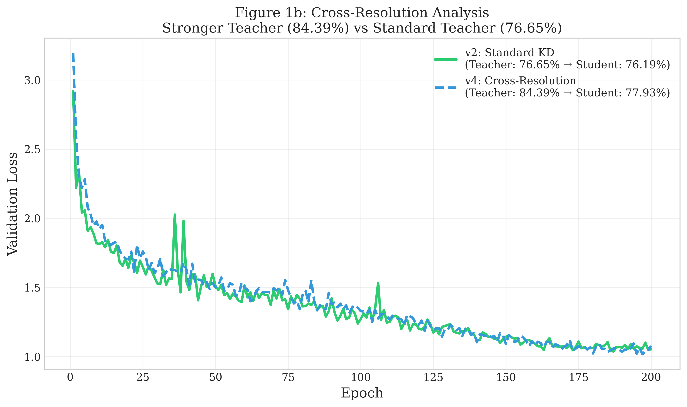
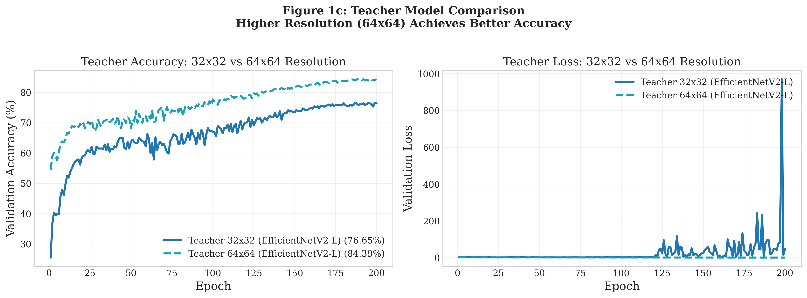
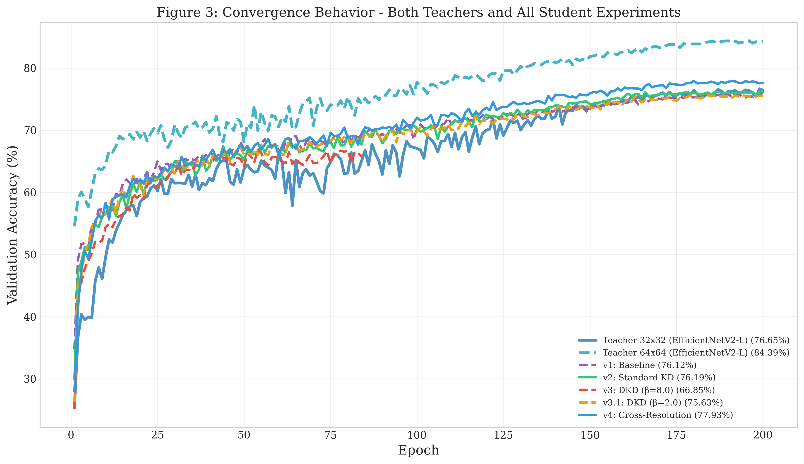
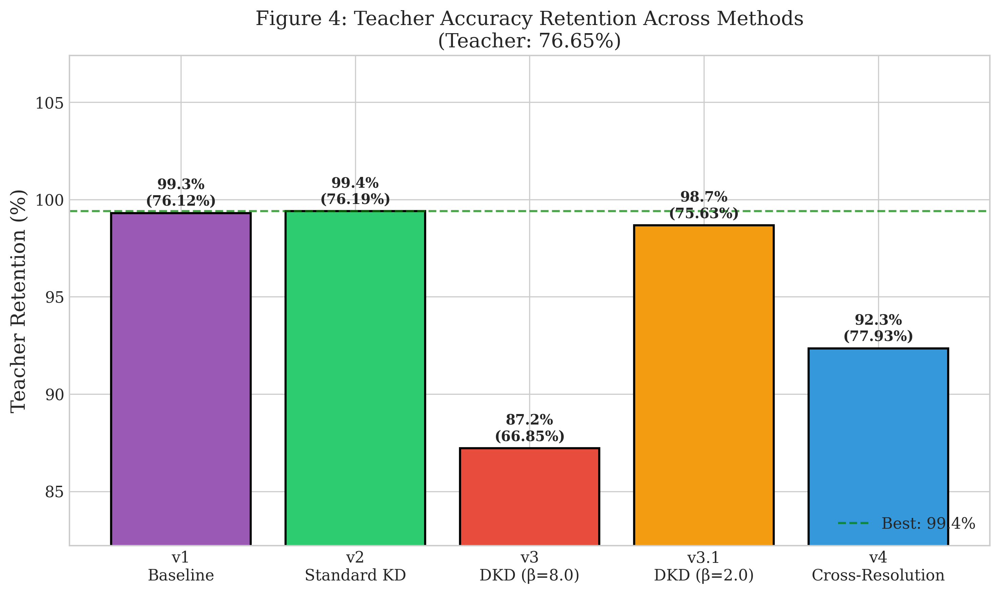
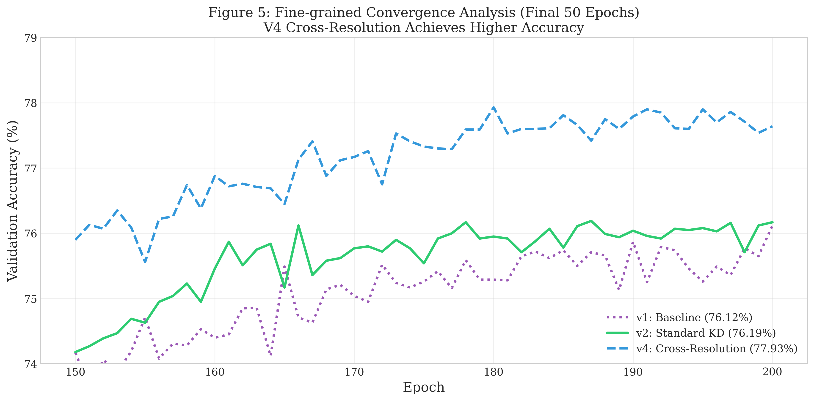
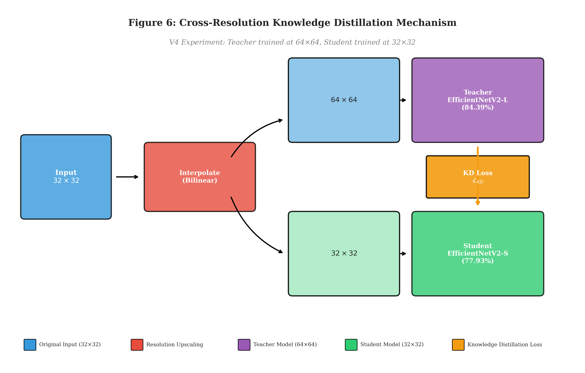

# Cross-Resolution Knowledge Distillation

Robust Model Compression Under Strong Data Augmentation for Compact Vision Models

[](https://python.org)
[](https://pytorch.org)
[](LICENSE)

## Overview

This repository contains the experimental code and results for a Master's thesis investigating **Knowledge Distillation (KD)** stability under strong data augmentation on the CIFAR-100 dataset. We demonstrate a novel **Cross-Resolution Distillation** approach that achieves superior model compression results.

### Key Contributions

1. **Regularization-Distillation Conflict**: We identify that Decoupled KD (DKD) with high β values collapses under strong augmentation, while Standard KD remains robust. This contradicts claims that DKD is universally superior.

2. **Cross-Resolution Distillation**: We achieve **77.93%** student accuracy by using a 64×64 Teacher with a 32×32 Student, providing a **1.74%** improvement over the baseline with zero additional inference cost.

3. **5.6× Model Compression**: The Student (21M parameters) retains **92.35%** of the Teacher's accuracy (84.39%) while being 5.6× smaller.

## Results Summary

| Model                              | Resolution | Accuracy   | Parameters | Compression      |
| ---------------------------------- | ---------- | ---------- | ---------- | ---------------- |
| Teacher (EfficientNetV2-L)         | 32×32      | 76.65%     | 118M       | —                |
| Teacher (EfficientNetV2-L)         | 64×64      | 84.39%     | 118M       | —                |
| Student (Standard KD, v2)          | 32×32      | 76.19%     | 21M        | 5.6× smaller     |
| **Student (Cross-Resolution, v4)** | **64→32**  | **77.93%** | **21M**    | **5.6× smaller** |
| Student (DKD, β=8.0)               | 32×32      | 66.85%     | 21M        | Collapsed        |
| Student (DKD, β=2.0)               | 32×32      | 75.63%     | 21M        | Recovered        |

### All Experiments

| Exp. | Method      | Resolution | Student Acc. | Gap   | Retention  | Key Insight      |
| ---- | ----------- | ---------- | ------------ | ----- | ---------- | ---------------- |
| v1   | Standard KD | 32×32      | 76.12%       | 0.53% | 99.31%     | Baseline         |
| v2   | Standard KD | 32×32      | 76.19%       | 0.46% | 99.40%     | Optimal (32×32)  |
| v3   | DKD (β=8.0) | 32×32      | 66.85%       | 9.80% | 87.21%     | Collapsed        |
| v3.1 | DKD (β=2.0) | 32×32      | 75.63%       | 1.02% | 98.67%     | Recovered        |
| v4   | Standard KD | 64→32      | **77.93%**   | 6.46% | **92.35%** | Cross-Resolution |

## Repository Structure

```text
KnowledgeDistillation/
├── code_v2_32/                 # Main experimental code (32×32 baseline)
│   ├── 01_run_experiment.ipynb # Training notebook
│   ├── 02_generate_figures.ipynb # Figure generation
│   ├── 03_compare_results.ipynb  # Results comparison
│   ├── config.py               # Configuration settings
│   ├── data.py                 # Data loading utilities
│   ├── models.py               # Model definitions
│   ├── utils.py                # Training utilities
│   ├── checkpoints/            # Saved model weights
│   ├── results/                # Experiment results (JSON, CSV)
│   └── figures/                # Generated figures (PDF, PNG)
├── reports/                    # LaTeX reports
│   └── supervisor_report_02/   # Progress report with results
├── thesis_proposal/            # Thesis proposal document
└── local/                      # Local notes and guidelines
```

## Methodology

### Models

- **Teacher**: EfficientNetV2-L (118M parameters), pre-trained on ImageNet, fine-tuned on CIFAR-100
- **Student**: EfficientNetV2-S (21M parameters, 5.6× smaller than teacher)

### Dataset

- **CIFAR-100**: 100 classes, 50K training images, 10K test images

### Data Augmentation

- **AutoAugment**: Automatically finds the best image transformations (CIFAR-100 policy)
- **Random Erasing** (p=0.25): Randomly masks parts of the image
- **Mixup** (α=0.8): Blends two images and their labels together
- **CutMix** (α=1.0): Cuts a patch from one image and pastes it onto another

### Optimization

- **AdamW** (lr=0.001, weight_decay=0.05)
- **Cosine Annealing LR** with linear warmup (5 epochs)
- **Label Smoothing** (0.1)
- **Mixed Precision** (FP16)
- **Gradient Clipping** (max_norm=1.0)
- **Early Stopping** (patience=30)

### Distillation Methods

**Standard KD** (Hinton et al., 2015):

```math
L_KD = α · T² · KL(p_s^T || p_t^T) + (1-α) · CE(y, p_s)
```

- α = 0.7 (balance weight)
- T = 4.0 (temperature)

**Decoupled KD** (Zhao et al., 2022):

```math
L_DKD = α · L_TCKD + β · L_NCKD
```

- α = 1.0 (target class weight)
- β = 8.0 or 2.0 (non-target class weight)

## Quick Start

### Requirements

```bash
pip install torch torchvision timm pandas matplotlib seaborn
```

### Hardware

- NVIDIA GeForce RTX 5070 Laptop GPU

### Training

```python
# Open and run the notebook
jupyter notebook code_v2_32/01_run_experiment.ipynb
```

### Generate Figures

```python
jupyter notebook code_v2_32/02_generate_figures.ipynb
```

## Key Findings

### 1. The Regularization-Distillation Conflict

State-of-the-art distillation methods like DKD are fragile when combined with modern regularization. AutoAugment and Mixup introduce noise that corrupts the "dark knowledge" DKD relies on.

**Mechanism of Failure**: Consider a Mixup image: `0.8 × Image_A + 0.2 × Image_B`. The Teacher's logits become a linear superposition of two classes. DKD with high β forces the Student to learn this noisy non-target distribution, causing gradient conflicts and training divergence.

### 2. Standard KD is More Robust

Standard KD achieved **99.40%** teacher retention without hyperparameter tuning, while DKD collapsed under strong augmentation. This makes Standard KD suitable for resource-constrained scenarios with heavy data augmentation.

### 3. Cross-Resolution Distillation Works

Using a higher-resolution Teacher (64×64) with a lower-resolution Student (32×32) improves performance by **1.74%** with zero additional inference cost.

**Why it works**: EfficientNetV2-L is pre-trained on ImageNet (224×224). Feeding it 32×32 images causes feature maps to degrade too early. Upscaling to 64×64 delays this spatial collapse, allowing the Teacher to utilize deeper layers more effectively.

**Green AI Implications**:

- Training Cost: Increased slightly (Teacher processes 64×64)
- Inference Cost: Unchanged (Student remains 32×32)
- Performance: Improved by 1.74%

### 4. DKD Requires Careful Tuning

DKD with β=8.0 collapsed to 66.85% (early stopping at epoch 84). Reducing β to 2.0 recovered performance to 75.63%, but still underperformed Standard KD by 0.56%.

## Visualizations

### Training Stability: Standard KD vs DKD


DKD (β=8.0) shows instability and early stopping at epoch 84, while Standard KD maintains stable convergence.

### Cross-Resolution Analysis



v4 (64×64 Teacher) achieves 77.93% vs v2 (32×32 Teacher) at 76.19%. The Student's performance ceiling is determined by Teacher quality.

### Teacher Resolution Impact



64×64 resolution improves Teacher accuracy from 76.65% to 84.39% (+7.74%).

### DKD β Parameter Effect


β=8.0 collapses to 66.85%, β=2.0 recovers to 75.63%.

### All Experiments Accuracy



v4 achieves highest accuracy (77.93%), v3 collapses to 66.85%.

### Teacher Retention



v4 achieves 92.35% retention (vs 84.39% Teacher), v2 achieves 99.40% retention (vs 76.65% Teacher).

### Zoomed Convergence (Final 50 Epochs)



v4 (77.93%) surpasses v2 (76.19%) and v1 (76.12%).

### Cross-Resolution KD Mechanism



Input upscaled to 64×64 for Teacher, Student uses 32×32. Zero additional inference cost.

## Limitations

1. **Single Architecture**: Only EfficientNetV2 (L and S variants) tested
2. **Single Dataset**: Evaluated on CIFAR-100 only
3. **Limited Resolution Range**: Cross-Resolution tested only between 32×32 and 64×64

## Citation

If you use this code in your research, please cite:

```bibtex
@mastersthesis{alrawahi2025crossres,
  title={Cross-Resolution Knowledge Distillation: Robust Model Compression Under Strong Data Augmentation for Compact Vision Models},
  author={Alrawahi, Gheith},
  school={Nankai University},
  year={2025}
}
```

## Author

**Gheith Alrawahi**  
Master's Student, Software Engineering  
Nankai University  
Supervisor: Prof. Jing Wang

## License

This project is licensed under the MIT License - see the [LICENSE](LICENSE) file for details.
